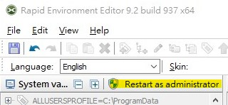
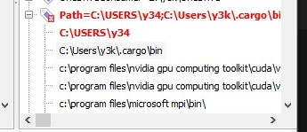
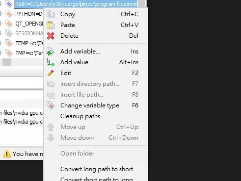

今天打command line指令發現自己寫的node module叫不出來，這才發現Windows的PATH變數爆掉，原來我真的有幸遇得到這天....  
  
面對已經太長的環境變數，我查到可以用分割的方式宣告，但這樣做又怕在更新的時候出錯。

在鄉民推薦下試了這個[Rapid Environment Editor](https://www.rapidee.com/en/about)，這個維護工具親身測試還不錯用，非常方便。大致說明基本使用方式，我自己目前也只用到這些步驟而已...XD  

開始之前建議不知道什麼是Path變數的先去溫習一下，這是跟系統穩定性有關的設定，亂設系統會壞掉要重灌。  

1. 視窗的右半部跟左半部分別是個人變數與系統變數；如果要編輯系統變數則需要按按鈕取得權限...  
  

2. 開啟後先把標紅的項目刪一刪...  
  
標紅表示那個項目在檔案系統中已不存在，如果是出現在Path以外的地方建議弄清楚是什麼再下手。  

3. 刪完之後再按右鍵Cleanup paths  
  

最後記得要儲存，這樣基本上維護就完成了。

上面會注意到，他右鍵選單還有縮短path變數(Convert long path to short)的功能，做法就是把某些變數變成早期DOS的那種毛毛蟲`～`結尾的長檔名變體，但這種做法很可能導致不必要的問題，所以我沒有利用之。