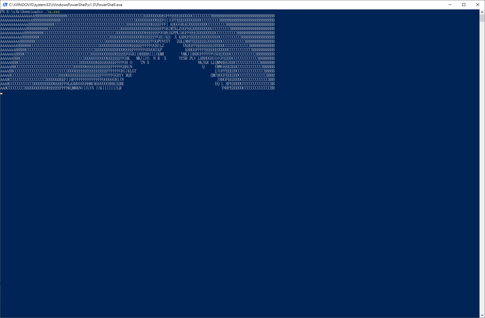
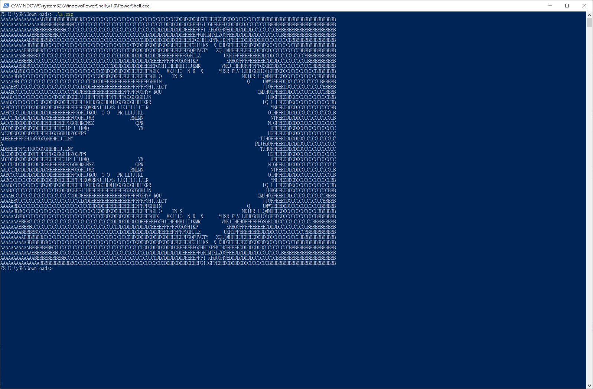

剛剛看到鄉民在問，於是去找了一個看起來能跑的[BrainFuck]()程式碼。([https://www.quora.com/What-is-the-most-complex-program-written-in-the-Brainfuck-language](https://www.quora.com/What-is-the-most-complex-program-written-in-the-Brainfuck-language))

但是又懶得去弄[Compiler](https://github.com/Wilfred/bfc)，怎麼辦呢....，就試著去找了C轉譯器，結果還真的有，而且只是用Python寫的一個[小工具](https://github.com/paulkaefer/bftoc)。

最後轉出來的.c再compile，還真的跑出來XDDD

  

順便也把bftoc做fork下來。其實看轉出來的C，就不難看懂BrainFuck在玩什麼了。