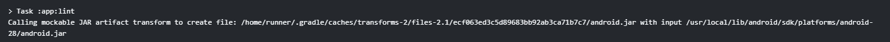

最近Github有了[Actions](https://github.com/actions)功能，就是個CI([Continious Integration](https://zh.wikipedia.org/wiki/持續整合))。

之前自己在玩[CircleCI](https://circleci.com/)，覺得還不錯，也已經在各式開源專案看人用過了；本來在考慮自己的開源專案會需要這東西做自動化，甚至考慮目前私有的專案開放出來，結果Github就自己弄出來了XDD

Github的Actions也不是完全免費的，每月有固定的運算[分鐘數](https://github.com/pricing)可供使用，用超過要給錢吧..?遇到再說。

Github也提供了跟其他CI一樣的Badge功能，連結格式是這樣：  
`https://github.com/{owner}/{repo}/workflows/{workflow_name}/badge.svg`  
寫成markdown的話：  
``  
本來有擔心這個連結外露的風險，後來發現Github有做permission check的動作，對Repo沒權限的人是看不到圖的。

紀錄一下在Android專案上遇到的一點坑：

1. lint會需要取消abortOnError的機能，像我就遇到不明所以的package reference error，是org.apache的包搞出來的。  

2. gradlew執行檔會需要先chmod +x再行commit給權限。Windows下則要用[git update-index](https://github.com/actions/starter-workflows/issues/171)處理。  
Update: 可以在yml裡面加一個job去chmod。

一些Note：

1. 鄉民做的Action例，把build出的debug apk publish到github專案的Release上。[https://github.com/ShaunLWM/action-release-debugapk](https://github.com/ShaunLWM/action-release-debugapk)  
!!重要：如果直接用master branch會導致infinite loop一直跑build，要記得將workflow對應到另一個release之類的branch接聽事件。

總之暫時先不用搞CircleCI了，爽耶XDD
